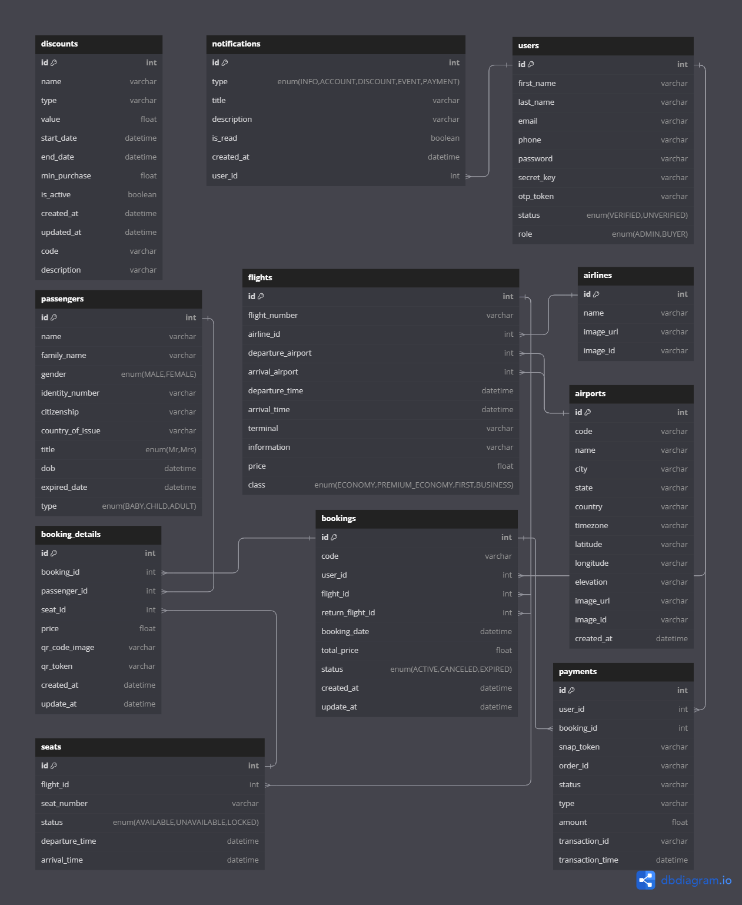

# AirFly - Airplane Booking Tickets

     

 
Welcome to **AirFly**, a modern and secure flight booking platform developed by **Team 1 FSW x BE Binar KM 7**. Our platform offers a seamless and interactive experience for booking flights, managing payments, and receiving real-time notifications.

## 🚀 **Project Overview**

AirFly is designed to provide users with a fast, reliable, and secure way to book flights. With an intuitive user interface, advanced payment system, and real-time notifications, AirFly aims to be a one-stop solution for all your flight booking needs.

---

## ✨ **Key Features**

### 1. **Flight Management**

- **Search and Browse Flights**: Easily search for available flights by destination, date, and airline.
- **Flight Details**: View flight information, including departure time, arrival time, airline details, and pricing.

### 2. **Booking System**

- **Easy Booking**: Book one-way or round-trip flights in just a few simple steps.
- **Manage Bookings**: View, update, or cancel your flight bookings directly from your user dashboard.

### 3. **Secure Payment System**

- **Multiple Payment Methods**: Pay securely with various payment methods such as credit/debit cards, e-wallets, and more.
- **Safe Transactions**: Our platform ensures your payment information is encrypted and secure.

### 4. **Real-Time Notifications**

- **Booking Updates**: Receive instant updates on your booking status.
- **Payment Confirmation**: Get real-time notifications on payment success or failure.
- **Promotions and Discounts**: Stay informed about the latest promotions and exclusive offers.

### 5. **Interactive and Modern User Interface**

- **User-Friendly Design**: Navigate the platform with ease using our modern and intuitive user interface.
- **Responsive Design**: Enjoy a seamless experience on both desktop and mobile devices.

### 6. **Other Features**

- **Multi-Language Support**: Access the platform in different languages for a more inclusive experience.
- **Comprehensive User Dashboard**: View and manage your bookings, payments, and profile in one place.

---

## ⚙️ **Technology Stack**

- **Frontend**: HTML, CSS, JavaScript, and modern UI frameworks.
- **Backend**: Node.js, Express.js, and REST APIs.
- **Database**: PostgreSQL or MySQL for efficient data storage and retrieval.
- **Real-Time Features**: WebSocket for live notifications and updates.

---

## 📚 **How to Use**

1. **Register/Login**: Create an account or log in to access the platform.
2. **Search Flights**: Search for flights by destination, date, and preferred airlines.
3. **Book Flights**: Select your flight, choose your seat, and confirm your booking.
4. **Make Payment**: Complete the payment securely through multiple payment options.
5. **Receive Notifications**: Stay updated with real-time notifications on your flight status, payments, and promotions.

---

## 🤝 **Contributing**

We welcome contributions from the community! If you'd like to contribute to the project, feel free to fork the repository and create a pull request. Please ensure your code follows the project's coding guidelines.

---

## 🔐 **Security**

AirFly is built with security as a top priority. We employ best practices for data encryption, secure payment processing, and user authentication.

---

## 📧 **Contact Us**

If you have any questions, feedback, or suggestions, feel free to reach out to **Team 1 FSW x BE Binar KM 7** at [support@airfly.com](mailto:viery15102002@gmail.com).

---

Thank you for choosing **AirFly** for your flight booking needs. Fly smart, fly safe, fly with AirFly! ✈️

## 🗃 **Attachments**

### ERD

     

 

### CODECOV

